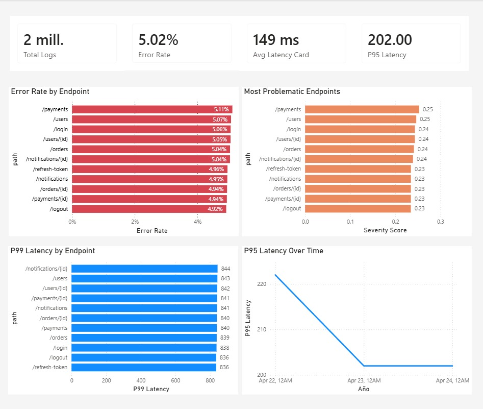
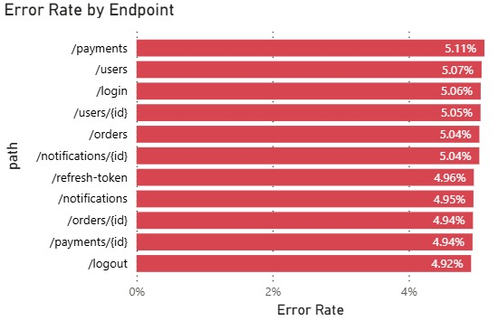
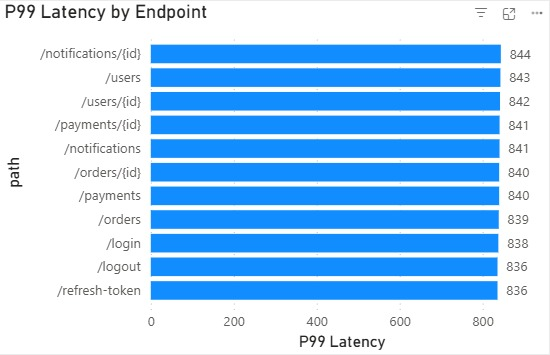
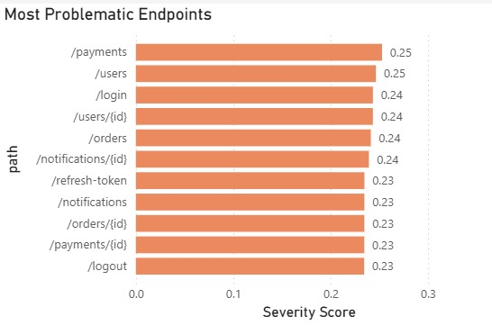

# Logs Analytics & Performance Monitoring

Plataforma de análisis de rendimiento para APIs basada en millones de registros de logs. El proyecto combina generación de datos sintéticos, modelado relacional en PostgreSQL y visualización ejecutiva en Power BI para detectar latencia, error rate y endpoints críticos.

## Problema que resuelve

En entornos con alto volumen de tráfico, identificar degradación de servicios por endpoint y por ventana temporal es difícil si los logs están dispersos. Este proyecto centraliza la observabilidad para responder, en segundos, preguntas como:

- Qué endpoints tienen más errores 5xx.
- Cuáles presentan mayor latencia P95 y P99.
- Qué servicios están en riesgo por tendencia o picos anómalos.

## Arquitectura

1. `data_generator/generator.py` genera logs sintéticos masivos.
2. PostgreSQL almacena el modelo relacional y soporta análisis SQL.
3. `sql/queries.sql` contiene consultas analíticas y de diagnóstico.
4. Power BI consume la base para construir el dashboard ejecutivo.

## Estructura del proyecto

```text
logs-analytics-project/
├── data_generator/
│   └── generator.py
├── sql/
│   ├── schema.sql
│   ├── indexes.sql
│   └── queries.sql
├── powerbi/
│   └── logs_dashboard.pbix
├── images/
├── README.md
├── requirements.txt
└── .gitignore
```

## Modelo de datos

- `services`: catálogo de servicios.
- `endpoints`: rutas HTTP por servicio y método.
- `logs_access`: eventos de acceso con latencia, status code e IP.
- `logs_error`: detalle de errores relacionados con accesos 5xx.

Relación principal:

- `services (1) -> (N) endpoints`
- `endpoints (1) -> (N) logs_access`
- `logs_access (1) -> (N) logs_error` a nivel de `log_id + timestamp`

## Métricas principales

- Error Rate 5xx (%).
- Error Rate 4xx (%).
- Latencia promedio (ms).
- P50 / P95 / P99 Latency.
- Severity Score.
- Tendencia móvil de 24 horas.

## Insights del dashboard

- Identificación rápida de endpoints con degradación sostenida.
- Detección de picos de latencia antes de que impacten el servicio.
- Priorización de incidencias por combinación de volumen, latencia y tasa de error.
- Comparación entre servicios para ubicar cuellos de botella.

## Vista previa

### Dashboard general


### Error rate por endpoint


### Latencia P95 / P99


### Endpoints más problemáticos


## Tecnologías utilizadas

- Python 3
- Faker
- PostgreSQL
- SQL analítico
- Power BI

## Cómo ejecutar el proyecto

### 1. Instalar dependencias

```bash
pip install -r requirements.txt
```

### 2. Crear la base de datos y el esquema

Ejecuta primero `sql/schema.sql` y luego `sql/indexes.sql` en PostgreSQL.

### 3. Generar datos

```bash
python data_generator/generator.py
```

Parámetros configurables por entorno:

- `BATCH_SIZE` (por defecto: 1000)
- `TOTAL_BATCHES` (por defecto: 1500)
- `ERROR_BATCH_SIZE` (por defecto: 5000)

### 4. Cargar Power BI

Abre `powerbi/logs_dashboard.pbix` y actualiza la fuente hacia tu instancia local de PostgreSQL.

## SQL incluido

- `schema.sql`: definición de tablas y claves.
- `indexes.sql`: índices para acelerar filtros y joins.
- `queries.sql`: queries analíticas y `EXPLAIN ANALYZE`.

## Cierre

Este proyecto presenta una base sólida para análisis de logs a escala, con generación masiva de datos, modelo relacional en PostgreSQL, consultas analíticas optimizadas y un dashboard ejecutivo para seguimiento de rendimiento y errores.